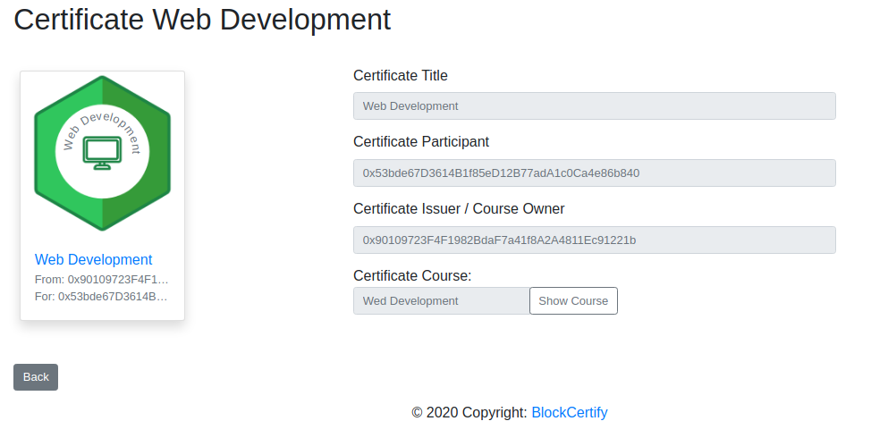
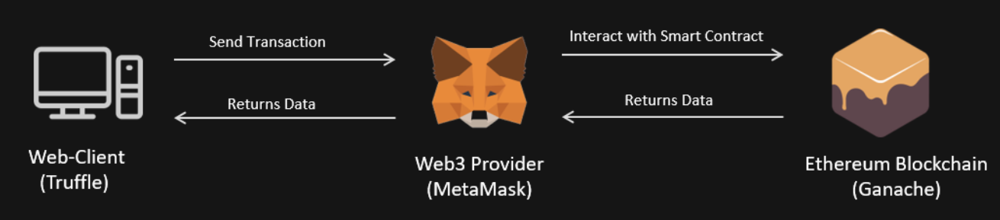

# BlockCertify 
>Certification instance based on solidity for the Ethereum Blockchain

## Table of Contents

- [About](#about)
- [Functionality](#functionality)
- [Documents](#documents)
- [Requirements](#requirements)
- [Installation](#installation)
- [Run application](#run-application)

## About
Certification System that uses a Blockchain. There are two roles: issuer, participant. As an issuer you can create courses. The issuer can add and remove participants addresses to the course. After that the course owner can generate certificates for a selection of the course participants. These certificates are stored in a ethereum block chain. As a participant the application displays courses i participate and certificates i received. Both roles log in with metamask with the address and private Key for the (local) blockchain.

## Documentation

## Functionality
* Sign into the webapp using your address with Metamask 
* Create a course 
* Add and Remove participants to/from a course
* Issue certificates for certain participants of a course
* Display certificates and courses assigned to signed in address 
* Display certificates and courses assigned to other addresses (provide search function)

### Certificates
Our certificates contain:
* Issuer address 
* Recipient address 
* Title of certificate 
* Course Id of certificate 

Preview:

### Architecture

## Requirements
* NodeJS [(download & install)](https://nodejs.org/en/)
* Ganache [(follow the official Quickstart guide)](https://www.trufflesuite.com/docs/ganache/quickstart)
* Metamask Browser Plugin [(install in your browser, supports Chrome, Firefox, IE and Brave)](https://metamask.io/download.html)

## Installation Guide

## Developer Links
* [Team Description](https://dhbwstg-my.sharepoint.com/:w:/g/personal/inf18200_lehre_dhbw-stuttgart_de/EQepBS1bCaZKkkIirMOSuSkB5mS8uptXrDt5dB3pTiHiKw?e=5psYY9)
* [Team Presentation](https://dhbwstg-my.sharepoint.com/:p:/g/personal/inf18200_lehre_dhbw-stuttgart_de/EaSqSujzyTlEosuql-bChuoBrbgE39MxWxldudZCXU6MnQ?e=DM1EkB)

